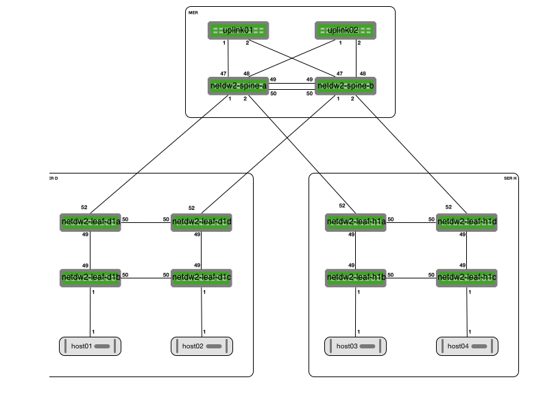

# cl-provision

# Introduction
- There are multiple folders whit different functions
* [ansible](ansible/README.md) contains all files needed to run the provision playbook
* [diagrams](diagrams/README.md) contains some diagrams designed for the virtual staging area
* [oob-server](oob-server/README.md) contains all files needed to setup the OOB-server.
* [staging](staging/README.md) contains all files to setup a virtual staging area, using vagrant+libvirt on kvm.

# Workflow
- The OOB-server passes DHCP options so switches can find the cumulus.bin and ztp files.
- The ONIE bootloader loads the needed .bin file and installs Cumulus Linux.
- Cumulus Linux boots for the 1st time and ZTP pulles the ztp_oob.sh script to install ssh keys, set a license key, and set a mgmt interface on mgmt VRF.
  Also a nice MOTD is set and a provisioning callback is done to Ansible AWX.
- Ansible AWX runs the 1st provisioning playbook to set PTM+.dot file, users, and interfaces.

# Decisions
- We are setting all switches in sets of maximum 4
- All uplinks/downlinks/pairs will use active-active mlag.

# Setup
- Clone this repo and:
* Setup the OOB-Server
* Setup the ansible playbook on the OOB-Server

# Diagram
The following diagram is the basis for the virtual environment. This can also be used to be a template for the physical environment.

  
