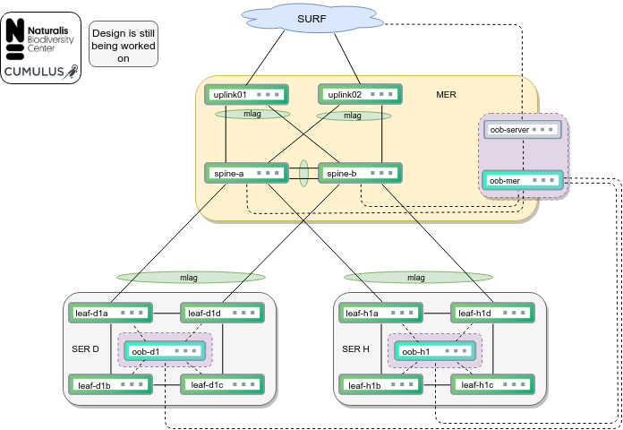

# cl-provision

# Introduction
There are multiple folders with different functions
* [ansible](ansible/) contains all files needed to run the playbooks
* [diagrams](diagrams/) contains some diagrams designed for the virtual staging area and template for the physical environment.
* [oob-server](oob-server/) contains all files needed to setup the OOB-server.
* [staging](staging/) contains all files to setup the virtual staging area, using vagrant+libvirt on kvm.

# Decisions
- We are connecting all switches in a set, with a maximum of four.
- All uplinks/downlinks/peerlinks will make use of active-active mlag.
- All management ports (eth0) of the switches will be connected to an oob-switch. Each SER will have an oob-switch on management VRF, which will be directly connected (sm fiber) to the oob-switch in the MER. Here the oob-server (MAAS ha-setup) will be connected.
- The oob-server/MAAS will be used as the DHCP/DNS/NTP server.
- Ansible AWX will run in the DC, while the oob-server/MAAS will be installed in the MER

# Setup
First the oob-server has to be setup. After cloning this repo, setup the [oob-server](oob-server/) (and dhcp server) and boot the switches.

The OOB-server passes DHCP options so switches can find the cumulus.bin and ztp files.

After booting up for the first time the ONIE bootloader loads the needed .bin file from the oob-server and installs Cumulus Linux. If there is already Cumulus Linux running you can force a reinstall by:
```bash
sudo onie-select -i
```

After the inital install Cumulus Linux will start for the first time and the ZTP service will pull the ztp_oob script from the oob-server. This script will install the needed ssh keys, set a license key, and set a mgmt interface on mgmt VRF. Also a nice MOTD is set and a provisioning callback is done to Ansible AWX.

If all setup correctly you can watch the access.log on the oob-server, to see incoming requests.:
```bash
sudo tail -f /var/log/apache2/access.log
```
(If enabled) the ZTP script will do a provision callback to Ansible AWX and the 1st provisioning playbook will be started, to set PTM+.dot file, users, and interfaces.

If all switches pulled the ztp_oob.sh file (and ran the provision.yaml playbook if the provision callback is enabled) and restarted switchd you can test the connections with [ansible](ansible/):
```bash
ansible all -m ping
```
Now is the time to start the provision playbook if the provision callback is not enabled, to finish the deployment:
```bash
ansible-playbook provision.yaml
```

There is also an interfaces playbook, which only checks the interfaces for changes.
```bash
ansible-playbook interfaces.yaml
```

# Design
The following diagram is the basis for the virtual environment. This diagram is also used as a template for the physical environment.

  

# Contributors:
- Foppe Pieters (Naturalis Biodiversity Center)
- Attilla de Groot (Cumulus Networks)
